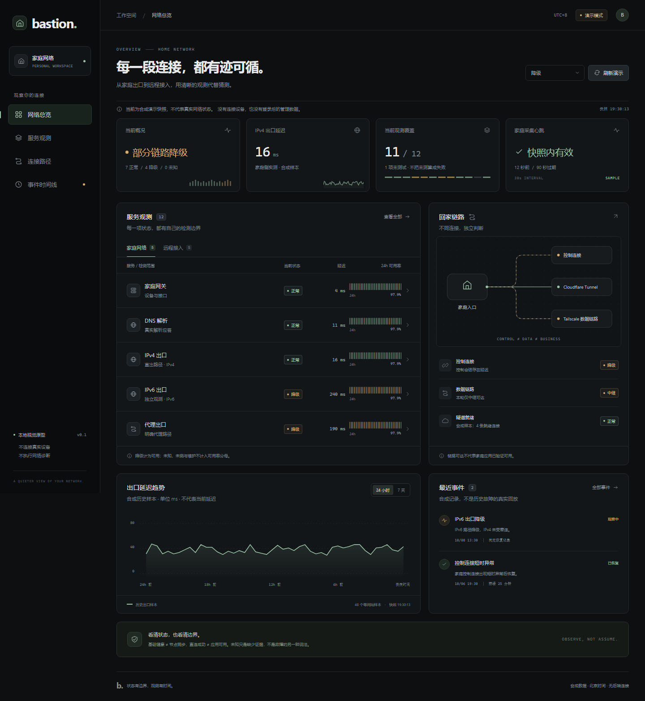

# Bastion · 家庭网络状态页

黑色 / 炭灰视觉风格的家庭网络状态页原型。用独立的控制层、数据层与业务观测，解释“家庭网络是否正常、能否回家、故障发生在哪一层”。

> 当前仅为前端视觉原型：全部状态、趋势与事件均是合成演示数据，没有后端、认证、真实采集器或设备连接。未测试与未知不等同于故障。
>
> 两份根目录规划文档已按公开发布要求脱敏：它们是通用设计/实施模板，不含真实网络拓扑、地址、主机名或凭据。仓库不包含任何真实部署清单，也不就后端、认证能力或开源许可证作出声明（未附带 LICENSE）。设备密钥、公钥、凭据、运行日志和依赖目录不提交。

## 本地运行

```bash
cd frontend
npm ci
npm run dev
```

打开 `http://127.0.0.1:5173/`。依赖版本已锁定；本机验证环境为 Node 22。

## 已实现

- 网络总览、服务观测、连接路径、事件时间线四个页面。
- 场景切换、服务搜索、状态筛选与原生详情弹窗。
- 24 小时合成趋势；7 天数据明确显示缺失。
- 数据过期显示未知，历史延迟与当前延迟分别展示。
- 桌面与手机布局、键盘操作与减少动效支持。
- 不使用外部字体、CDN 或 MCP 依赖。



## 检查

```bash
cd frontend
npm test
npm run build
npm run check:ui
```

本地已通过 28 项单元测试与 48 项浏览器检查（新增公开内容守卫测试，扫描公开源文件与文档中的地址、私钥与令牌）。浏览器检查要求 Node 22+ 和本机 Chrome，通过隔离的无头浏览器完成，不读取个人浏览器配置，不连接真实设备。

## 文档与目录

- [通用设计（公开脱敏版）](home-network-status-project.md)
- [实施阶段 Plan](home-network-status-implementation-plan.md)
- [前端使用与数据契约](frontend/README.md)
- [视觉设计与真实数据接入边界](frontend/DESIGN.md)
- `frontend/src/`：界面、样式、合成数据与派生逻辑。
- `frontend/tests/`：数据契约、状态语义与公开发布内容守卫测试。
- `frontend/artifacts/`：纯演示截图。

## 下一阶段

依据实施计划核实采集接口与权限，再开发 Go 后端、SQLite 存储、家庭与公网采集器。当前视觉与数据模型不能代替后端认证、公开字段脱敏、探测授权或故障判定。
